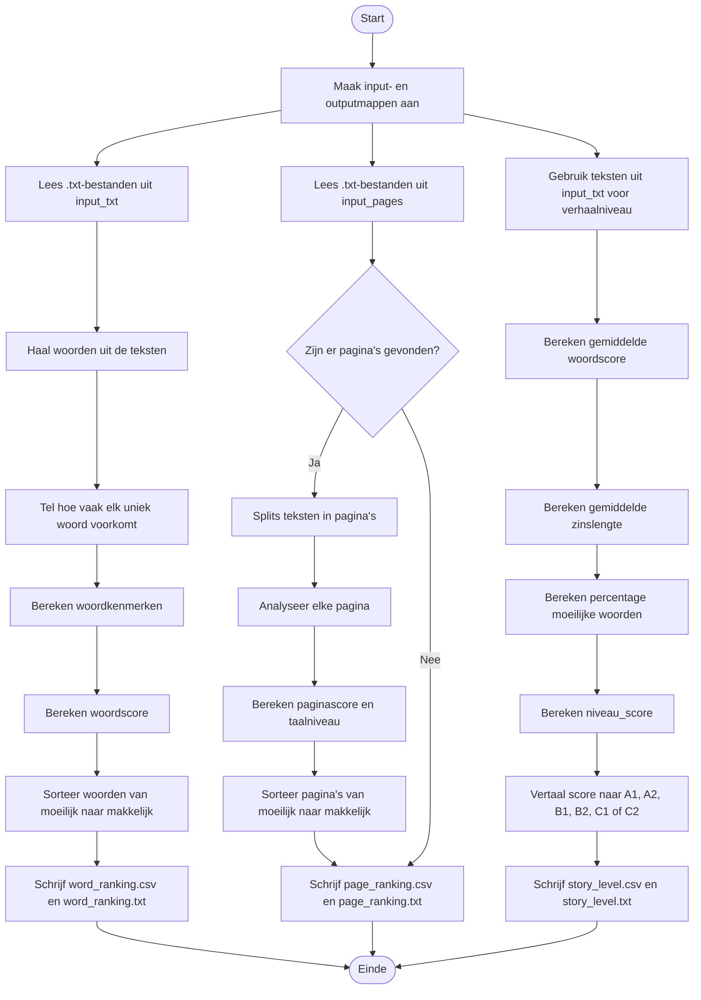

# Activity Diagram

Dit diagram laat zien wat er gebeurt wanneer je `python rank_words.py` uitvoert.

```mermaid
flowchart TD
    A([Start]) --> B[Maak input- en outputmappen aan]

    B --> C[Lees .txt-bestanden uit input_txt]
    C --> D[Haal woorden uit de teksten]
    D --> E[Tel hoe vaak elk uniek woord voorkomt]
    E --> F[Bereken woordkenmerken]
    F --> G[Bereken woordscore]
    G --> H[Sorteer woorden van moeilijk naar makkelijk]
    H --> I[Schrijf word_ranking.csv en word_ranking.txt]

    B --> J[Lees .txt-bestanden uit input_pages]
    J --> K{Zijn er pagina's gevonden?}
    K -- Ja --> L[Splits teksten in pagina's]
    L --> M[Analyseer elke pagina]
    M --> N[Bereken paginascore en taalniveau]
    N --> O[Sorteer pagina's van moeilijk naar makkelijk]
    O --> P[Schrijf page_ranking.csv en page_ranking.txt]
    K -- Nee --> P

    B --> Q[Gebruik teksten uit input_txt voor verhaalniveau]
    Q --> R[Bereken gemiddelde woordscore]
    R --> S[Bereken gemiddelde zinslengte]
    S --> T[Bereken percentage moeilijke woorden]
    T --> U[Bereken niveau_score]
    U --> V[Vertaal score naar A1, A2, B1, B2, C1 of C2]
    V --> W[Schrijf story_level.csv en story_level.txt]

    I --> X([Einde])
    P --> X
    W --> X
```

