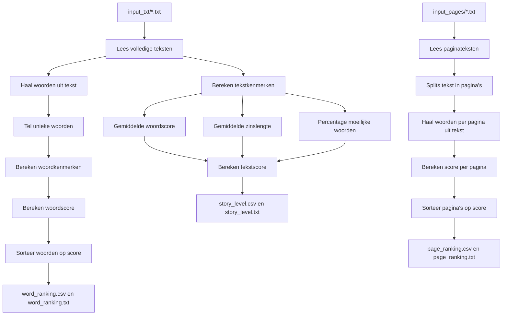

# Data Flowchart

Deze flowchart laat zien hoe de tekstdata door het project stroomt: van invoerbestanden naar woorden, scores en outputbestanden.

```mermaid
flowchart TD
    A[input_txt/*.txt] --> B[Lees volledige teksten]
    B --> C[Haal woorden uit tekst]
    C --> D[Tel unieke woorden]
    D --> E[Bereken woordkenmerken]
    E --> F[Bereken woordscore]
    F --> G[Sorteer woorden op score]
    G --> H[word_ranking.csv en word_ranking.txt]

    B --> I[Bereken tekstkenmerken]
    I --> J[Gemiddelde woordscore]
    I --> K[Gemiddelde zinslengte]
    I --> L[Percentage moeilijke woorden]
    J --> M[Bereken tekstscore]
    K --> M
    L --> M
    M --> N[story_level.csv en story_level.txt]

    O[input_pages/*.txt] --> P[Lees paginateksten]
    P --> Q[Splits tekst in pagina's]
    Q --> R[Haal woorden per pagina uit tekst]
    R --> S[Bereken score per pagina]
    S --> T[Sorteer pagina's op score]
    T --> U[page_ranking.csv en page_ranking.txt]
```
